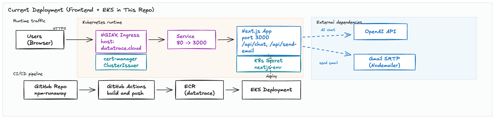
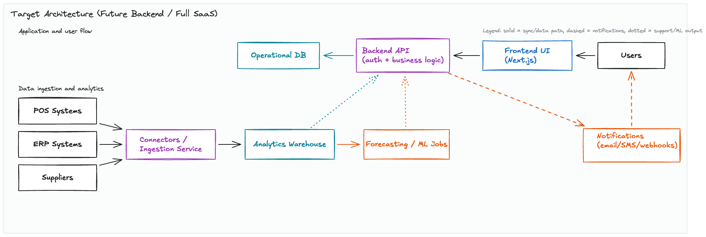

# datatrace (Hackathon Prototype)

Product name: `datatrace`.
Repository name: `npm-runaway`.
GitHub repository: [matoanbach/npm-runaway](https://github.com/matoanbach/npm-runaway)

`datatrace` is a hackathon prototype for a Data Analytics + POS SaaS concept for the food industry. It demonstrates how restaurants, grocery chains, and suppliers could use real-time analytics to monitor inventory and sales, reduce waste (especially near-expiry items), and manage supplier compliance.

## Who It’s For

Organizations:
- Restaurants, catering services, supermarkets, grocery chains, food distributors, and food manufacturers.

People:
- Store/restaurant managers: see what is selling and what is about to expire.
- Purchasing/operations teams: adjust ordering and promotions based on demand signals.
- Sustainability teams: track waste reduction outcomes.
- Supplier managers: validate supplier certifications and documentation.

## What It Does 

This prototype includes:
- A marketing/landing page with a company vs supplier “view” concept.
- Company dashboards and analytics pages with charts (sales trends, KPIs, reports).
- Stock / expiry monitoring screens (demo data) and a “send alert email” flow.
- Supplier dashboard with certification workflow UI and PDF generation.
- An in-app AI chat widget backed by an OpenAI-powered `/api/chat` route (currently configured to use model `gpt-4o`).

Notes:
- Many screens are demo-driven and pull from JSON files in `src/mock/**`.
- The “weather” tool in `/api/chat` is a stub (random data) and is just a demo of tool-calling.

## Team

Built during a hackathon with:
- [Jasleen Kaur](https://www.linkedin.com/in/jasleen-k-7a6287253/)
- [Kevin Liu](https://www.linkedin.com/in/kliuengineering/)
- [Andy Yuchi Zheng](https://www.linkedin.com/in/andy-zh/)
- [Karyna Lim](https://www.linkedin.com/in/karynalim/)

## Tech Stack

- Next.js 14 (App Router), React 18
- Tailwind CSS + shadcn/ui (Radix UI)
- Recharts (dashboards/charts)
- Zustand (state)
- Vercel AI SDK (`ai`, `@ai-sdk/react`, `@ai-sdk/openai`) + OpenAI
- Nodemailer (email sending)
- pdfme (PDF generation)

## Project Layout

- Landing page: `src/app/page.tsx`
- Demo pages (company + supplier): `src/app/(demo)/**`
- API (Next.js route handlers): `src/app/api/chat/route.ts`, `src/app/api/send-email/route.ts`
- Mock/demo data: `src/mock/**`
- Deployment manifests: `eks/*.yaml`
- CI workflow: `.github/workflows/deploy.yaml`

## Run Locally

Requirements:
- Node.js: works with Node `22.x` or `23.x` (Dockerfile uses `node:23-alpine`).

Commands:
```bash
npm install
npm run dev
```

Then open `http://localhost:3000`.

Other useful scripts:
```bash
npm run lint
npm run build
npm run start
```

## Environment Variables

Server-side:
- `OPENAI_API_KEY` (required to use the AI chat endpoint `/api/chat`).
- `APP_URL` or `VERCEL_URL` (optional; used to build canonical URLs for metadata in `src/app/layout.tsx`).
- `PORT` (optional; defaults to 3000).

Email (currently referenced as public env vars in the demo flow):
- `NEXT_PUBLIC_MAIL_USERNAME`
- `NEXT_PUBLIC_MAIL_PASSWORD`
- `NEXT_PUBLIC_MAIL_RECEIVERNAME`

Email implementation note: the server route `/api/send-email` uses Nodemailer with Gmail SMTP, so you typically need a Gmail app password (not your normal account password).

Security note: using `NEXT_PUBLIC_*` for email credentials is not production-safe. See “What To Improve”.

## Run With Docker (Using The Included Dockerfile)

```bash
docker build -t datatrace:local .
docker run --rm -p 3000:3000 \
  -e OPENAI_API_KEY="..." \
  datatrace:local
```

## Cloud Architecture

### Current (What’s In This Repo)

The current implementation includes an AWS/EKS deployment setup for the frontend container:
- Docker image built from this repo (`Dockerfile`).
- GitHub Actions workflow builds and pushes the image to AWS ECR (`.github/workflows/deploy.yaml`).
- Kubernetes manifests deploy the container to EKS (`eks/deployment.yaml`, `eks/service.yaml`).
- NGINX Ingress routes traffic (host is currently `datatrace.cloud`) (`eks/ingress.yaml`).
- cert-manager ClusterIssuer for Let’s Encrypt is provided (`eks/issuer.yaml`).

Architecture diagram:

This view separates the runtime request flow from the CI/CD delivery path so it is easier to see how the app is deployed and what external services it depends on.



### Target (Future Backend, Not In This Repo)

For a real POS + analytics SaaS, this UI would typically sit on top of:
- Ingestion services for POS/ERP (SAP, Oracle, Dynamics, Odoo) and supplier feeds.
- A backend API (auth, multi-tenant orgs, RBAC, audit logs).
- A database + warehouse (operational DB + analytics store).
- A forecasting/ML pipeline (demand forecasts, expiry risk scoring).

Architecture diagram:

This target-state view shows the additional backend, ingestion, storage, and forecasting layers that would typically sit behind the frontend in a production system.



## CI/CD (GitHub Actions)

Workflow file: `.github/workflows/deploy.yaml`
- Trigger: pushes + PRs to `main`.
- It builds a Docker image and pushes tags to ECR (`latest` + commit SHA).
- Deployment step (kubectl apply) is present but commented out.

Secrets referenced by the workflow:
- `AWS_ROOT_ACCESS_KEY`
- `AWS_ROOT_SECRET_ACCESS_KEY`

## What To Improve

Product:
- Replace mock/demo JSON data with real backend APIs.
- Add authentication and role-based access (company vs supplier, multiple orgs).
- Add exportable reports (PDF/CSV) and audit trails.

Security:
- Move email credentials to server-only env vars (no `NEXT_PUBLIC_*`).
- Avoid hardcoding personal emails in cluster issuer config; make it environment-specific.
- Add rate limiting + input validation for `/api/chat` and `/api/send-email`.

Engineering quality:
- Add automated tests (unit + integration/e2e).
- Add `typecheck` in CI.
- Make CI use AWS OIDC instead of long-lived access keys.

Cloud/ops:
- Align naming and account IDs between ECR/EKS configs (prototype configs may differ across files).
- Turn on observability (structured logs, metrics, tracing) and alerting.
- Document how TLS and DNS are set up for the ingress host.
